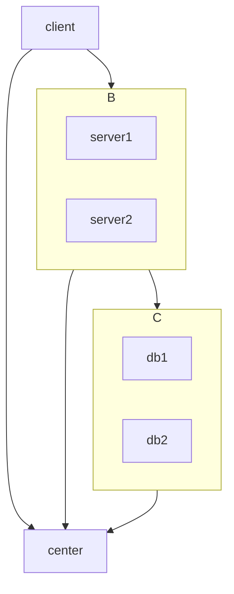

# overview

## 结构

- 客户端
  - sidecar / mesh
  - client proxy
- 服务端
  - server proxy
  - shard / 分布式事务
  - 注册中心
  - 配置中心

## 架构



## 层次

- connection: 调用语言相关的连接处理，获取语言相关的sql 
- parser: 调用语言相关的parser，把sql转化为语言相关的ast
- translator: 把语言相关的ast转化为中立的ast
- generate plan: 把中立的ast转化为plan
- optimizer: 对plan进行优化，输出任然为plan
- distributed executor: 执行plan，下推到对应的local executor
- local executor: 根据plan，生成语言相关的sql，下推到正真的db

## 测试

- 分层逻辑更清晰
- trace / metric

# issue 593

## 背景

- https://github.com/arana-db/arana/issues/593

## 方案

- optimizer
  - constant fold
- local executor
  - 直接使用内存数据库
    - 第三方
    - 自己造
  - sql预检查，然后再使用内存数据库
  - sql预检查，然后直接执行

## MYSQL

## 计算

- pkg/runtime/misc/extvalue/visitor.go
- pkg/runtime/misc/extvalue/extvalue.go
- pkg/runtime/misc/extvalue/extvalue_test.go

## 参考

```sql
select * from student where uid = 1 + 2
```
